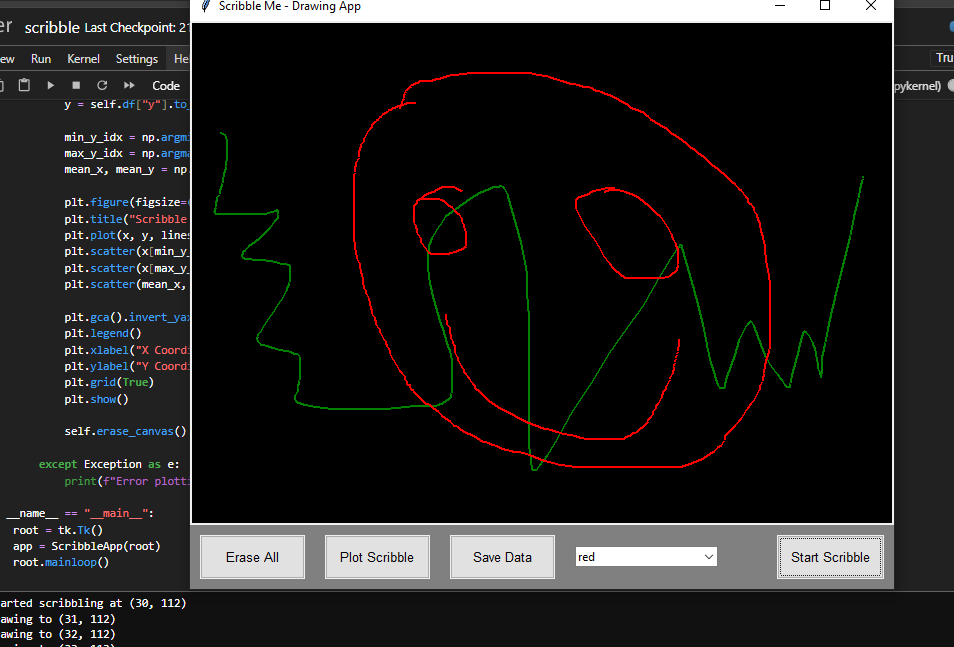
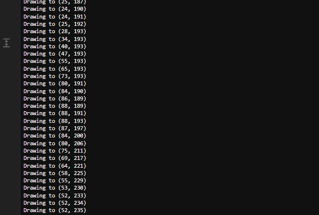
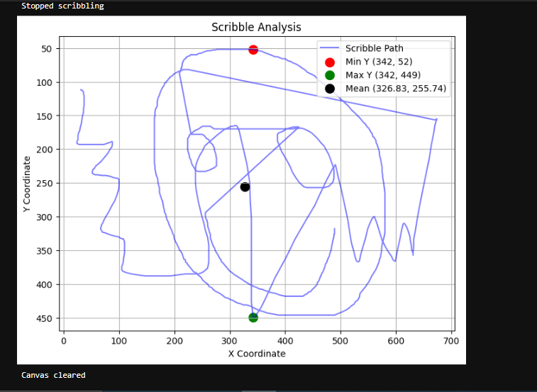

# Canvas-Scribble  - Interactive Drawing Tool

## Overview
this is a Python-based drawing tool i built on jupyter notebook that lets users create colorful sketches on a canvas using Tkinter. It tracks drawing coordinates, timestamps, and colors, stores in `Pandas DataFrame`, and generates a Matplotlib plotwith key `statistics like minimum, maximum, and mean coordinates`. This project showcases my skills in `Python, GUI development, data manipulation, and visualization`, built as part of my journey to explore data analysis and interactive applications.

## Features
1. Interactive Drawing
2. Data Tracking: Records x, y coordinates, timestamps, and colors of each drawing point using Pandas.
3. Visualization: Plots the scribble path with Matplotlib, highlighting `min/max y-coordinates and the mean point`.
4. User-Friendly Interface: `Includes buttons to start/stop drawing, erase the canvas, save data to a CSV, and plot the scribble`.

## Technologies Used
1. Python 3
2. Tkinter (GUI)
3. Pandas (data storage)
4. NumPy (data processing)
5. Matplotlib (visualization)

## Scribble Canvas — Project Screenshots
1. Drawing Interface (Canvas)
   This is the main interactive canvas where users can draw using the mouse
   
   
   
2. Tracked Coordinates
   Shows the recorded x and y coordinates
   
   
   
3. Visualization Output  
   A matplotlib plot highlighting the path, min/max y-coordinates, and the average point
   
   